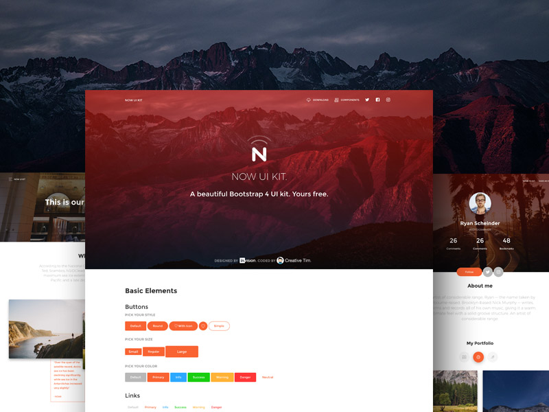
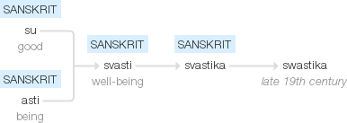

# Swastika I/O

Swastika I/O is free, open source and cross-platform CMS based on ASP.NET Core. It is built using the best and the most modern tools and languages (Visual Studio 2017, C# etc). Be the best and join our team!

[](https://gitter.im/Swastika-IO/Swastika-IO-Core?utm_source=badge&utm_medium=badge&utm_campaign=pr-badge)

## Buid status:
[](https://travis-ci.org/Swastika-IO/Swastika-IO-Core)  [](https://ci.appveyor.com/project/Smilefounder/swastika-core)

- Docs: [http://docs.swastika.io](http://docs.swastika.io)
- Demo: [http://demo.swastika.io](http://demo.swastika.io)
- Screenshot:  
  - Default template:

  - Admin:


## Swastika - swas·ti·ka (/ˈswästəkə/) mean:

 

From Sanskrit svastika, from svasti ‘well-being,’ from su ‘good’ + asti ‘being.

For the Hindus and Buddhists in India and other Asian countries, the swastika was an important symbol for many thousands of years and, to this day, the symbol can still be seen in abundance - on temples, buses, taxis, and on the cover of books. It was also used in Ancient Greece and can be found in the remains of the ancient city of Troy, which existed 4,000 years ago. The ancient Druids and the Celts also used the symbol, reflected in many artefacts that have been discovered. It was used by Nordic tribes and even early Christians used the Swastika as one of their symbols, including the Teutonic Knights, a German medieval military order, which became a purely religious Catholic Order. 

The word ‘swastika’ is a Sanskrit word (‘svasktika’) meaning ‘It is’, ‘Well Being’, ‘Good Existence, and ‘Good Luck’. However, it is also known by different names in different countries - like ‘Wan’ in China, ‘Manji’ in Japan, ‘Fylfot’ in England, ‘Hakenkreuz’ in Germany and ‘Tetraskelion’ or ‘Tetragammadion’ in Greece.

In Buddhism, the swastika is a symbol of good fortune, prosperity, abundance and eternity. It is directly related to Buddha and can be found carved on statues on the soles of his feet and on his heart.  It is said that it contains Buddha’s mind.

On the walls of the Christian catacombs in Rome, the symbol of the Swastika appears next to the words “ZOTIKO ZOTIKO” which means “Life of Life”. It can also be found on the window openings of the mysterious Lalibela Rock churches of Ethiopia, and in various other churches around the world.

It was historically a symbol of auspiciousness and good luck, but in the 1930s, the Nazis Hijack the Swastika and it became the main feature of Nazi symbolism as an emblem of Aryan race identity, and as a result, it has become stigmatized in the West by association with ideas of racism, hatred, and mass murder. You can read more about [why did the Nazis Hijack the Swastika](why-did-the-nazis.md)?

But after all, you should not blame or hate the Swastika at all. The swastika... has nothing to do with the swastika used as the symbol in Nazi Germany. 

**References:**
- [Learn the History of the Swastika](https://www.thoughtco.com/the-history-of-the-swastika-1778288)
- [The symbol of the Swastika and its 12,000-year-old history](http://www.ancient-origins.net/myths-legends/symbol-swastika-and-its-12000-year-old-history-001312)
- [What Is the Origin of the Swastika](https://www.thoughtco.com/what-is-the-origin-of-the-swastika-116913)

## Getting Started

These instructions will get you a copy of the project up and running on your local machine for development and testing purposes. See deployment for notes on how to deploy the project on a live system.

Note: This project is under heavy construction and is not intended for general production use yet. As such, we are not accepting bugs at the moment and documentation is quite lacking.

### Prerequisites

What things you need to install the software and how to install them

* [.NET](https://www.microsoft.com/net/core) - .NET Core framework
* [Visual Studio Community 2017](https://www.visualstudio.com/downloads/) - Free, fully-featured IDE for students, open-source and individual developers
* [SQL Server 2016+](https://www.microsoft.com/en-us/sql-server/sql-server-editions-express) - Database server


### Installing

1. Download the source code from [Github](https://github.com/Swastika-IO/Swastika-IO-Core)
2. Restore dotnet core Nuget's packages
```bash
cd [github-project-folder]\src\Swastika.Cms.Web.Mvc]
dotnet restore
```
3. Build dotnet core packages
```bash
cd [github-project-folder]\src\Swastika.Cms.Web.Mvc]
dotnet build
```
4. Then run! That it's!
```bash
cd [github-project-folder]\src\Swastika.Cms.Web.Mvc]
dotnet run
```
5. Now you can access the site from your localhost (e.g. http://localhost:58511)

Note: Please read the step how to prepare MS SQL Server Database [here](/installing?id=step-2-create-the-database-and-a-user).

## Contributing

Please read [CONTRIBUTING.md](CONTRIBUTING.md) for details on our code of conduct, and the process for submitting pull requests to us.

## Versioning

We use [SemVer](http://semver.org/) for versioning. For the versions available, see the [tags on this repository](https://github.com/Swastika-IO/Swastika-IO-Core/tags). 

## Authors

* **Smileway Team** - *Initial work* - [Smileway.co](http://www.smileway.co)

See also the list of [contributors](https://github.com/Swastika-IO/Swastika-IO-Core/graphs/contributors) who participated in this project.

## References
(TBC)

## License

This project is licensed under the MIT License - see the [LICENSE.md](LICENSE.md) file for details

## Thanks to

This project has been developed using:
* [Creative Tim](https://www.creative-tim.com/)
* [Bootstrap](https://getbootstrap.com/)
* [BrowserStack](https://www.browserstack.com/)
* [Micon](http://xtoolkit.github.io/Micon/icons/)
* [.NET](https://www.microsoft.com/net/core)
* And more...
